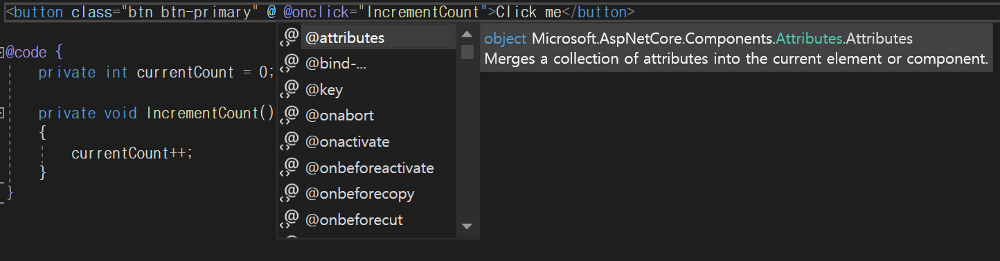

# Blazor_Study

## 목차   
1. [Blazor란](#blazor란)
2. [시작하기](#시작하기)
3. [클라이언트 구성](#클라이언트-구성)
4. [페이지 구성](#페이지-구성)
5. [컴포넌트 사용 예시](#컴포넌트-사용-예시)
6. [라이브러리 활용](#라이브러리-활용)
7. [구성 요소 수명주기에 따른 함수 활용](#구성-요소-수명주기에-따른-함수-활용)
8. [상태 유지](#상태-유지)
9. [컴포넌트 소개 및 사용예시]

---

### Blazor란

Microsoft의 오픈소스 웹 개발 프레임워크이다.    
일반적으로 웹 개발시 사용되는 JavaScript 대신 .Net Core와 WebAssembly를 기반으로 C#을 사용하여 웹 UI를 빌드할 수 있다.

Blazor Server와 Blazor Webassembly 모델로 구분할 수 있으며, 각각의 특징은 다음과 같다.    
* Blazor Server    
    * 서버측에서 대부분의 렌더링과 프로세싱이 이루어짐
    * 클라이언트와는 SignalR을 사용하여 통신
    * 오프라인 모드가 존재하지 않음
* Blazor Webassembly 
    * 클라이언트에서 대부분의 렌더링 및 로직이 이루어짐
    * 어플리케이션 실행시 브라우저에 모든 파일을 다운받아 정적으로 사용

<br>

---

### 시작하기


Visual Studio 2022 기준 Blazor 서버 앱 또는 Blazor WebAssembly 앱 템플릿을 선택할 수 있다.    
본 문서에서는 Blazor WebAssembly를 기준으로 설명한다.    


Blazor WebAssembly(WASM) 앱의 자산은 정적 파일로 배포되는데, 이 때 ASP.NET Core 호스팅 옵션으로 해당 파일을 제공하는 백엔드 앱의 사용 여부를 선택할 수 있다.    

[참고 : Blazor Server와 hosted Blazor WASM의 차이점](https://stackoverflow.com/questions/71265374/blazor-server-side-vs-blazor-webassembly-hosted)

본 문서에서는 호스팅된 Blazor WASM 모델을 기준으로 설명한다.


솔루션 생성시의 프로젝트 구성은 위 그림과 같다.    
- Client : 만들고자하는 실질적인 웹 어플리케이션
- Server : 해당 어플리케이션이 사용하는 API 컨트롤러를 호스팅
- Shared : Client와 Server 간에 공유되는 코드와 리소스 포함(DTO 등)    

완성된 앱은 Server 프로젝트에서 게시를 통해 배포할 수 있다.

<br>

---

### 클라이언트 구성


#### Pages 폴더

웹 어플리케이션에 라우팅되는 페이지들이 담겨져있는 폴더이다.    
**.razor** 확장자를 가진 파일이 각각의 페이지가 된다.

#### wwwroot 폴더
앱의 공용 정적 자산인 css파일 등을 포함하는 폴더이다.    
추후 외부 라이브러리를 활용할시 폴더 내의 index.html 파일에 css와 js 파일을 링크하여 사용한다.

#### Shared 폴더
공유 구성 요소 및 스타일시트를 포함하는 폴더이다.    
MainLayout.razor 파일에 앱의 레이아웃 구성 요소가 작성되어있으며, NavMenu.razor 파일에 사이드바 탐색이 구현되어있다.    
SurveyPrompt.razor 파일은 Blazor 설문 조사 구성 요소이므로 삭제해도 무방하다.    

#### _Imports.razor 파일
앱의 구성 요소에 포함할 네임스페이스의 @using 지시문을 모아두는 파일이다.

#### App.razor 파일
클라이언트의 라우팅을 설정하는 구성 요소 파일이다.    
기본적으로 잘못된 라우팅에 대한 처리도 되어있음을 확인할 수 있다.    

#### Program.cs 파일
앱의 진입점으로 호스트 설정, 서비스 등록등의 작업이 이루어지는 파일이다.

<br>

---

### 페이지 구성


@page : 해당 페이지가 라우팅되는 url 작성       
@using : 참조할 namespace 지정    
@inject : 사용할 서비스 주입     

이후 html 태그 형태로 컴포넌트들을 호출한다.    
위 그림과 같이 if 등의 구문을 @if 형태로 사용하는 것도 가능하다.    
로직에 사용할 C# 코드는 @code {} 에 구현한다. 이곳에 정의해놓은 변수와 함수들은 html 태그 내에서 바인드하여 사용할 수 있다.    

페이지는 아래와 같이 다양한 방식으로 라우팅할 수 있다.
* `@page “/루트이름”`
* `@page “/{파라미터 전달 값}`
* `@page “/{숫자 전달:int}`
* `@page “/루트이름/{카테고리}/{숫자:int}`

<br/>

---

### 컴포넌트 사용 예시


솔루션 생성시 기본적으로 작성되어있는 Counter.razor의 일부이다.    
문단을 생성하는 \<p>  컴포넌트에 변수 currentCount를 출력하도록 설정되어있다.   
그 아래의 \<button> 컴포넌트으로 버튼을 생성하고, @onclick 속성을 사용하여 클릭시 IncrementCount() 함수가 실행된다.    
단, 이 때 호출할 함수에 매개변수가 존재하는 경우에는 @(e => function(variable)) 과 같은 형태의 람다식을 사용한다.


위와 같이 컴포넌트 내에서 사용할 수 있는 속성들은 @ 기호를 통해 설정할 수 있다.    

<br>

---

### 라이브러리 활용

솔루션 생성시 css 폴더 내부에 bootstrap 폴더가 존재하는 것을 볼 수 있는데, 이는 오픈소스 라이브러리로 다양한 컴포넌트들을 반응형으로 지원한다.    
그밖에도 Radzen, Ant Design 등의 다양한 라이브러리가 존재하므로 이를 활용하여 다양한 컴포넌트들을 사용할 수 있다.    

[Bootstrap 라이브러리](https://getbootstrap.com/docs/5.3/getting-started/introduction/)    
[Radzen 라이브러리](https://blazor.radzen.com/get-started)    
[Ant Design 라이브러리](https://antblazor.com/en-US/components/overview)    

<br>

---

### 구성 요소 수명주기에 따른 함수 활용


* Setparameter()
* OnInitialized()
* Onparameterset()
* Onafterrender()

각 함수들이 구성 요소의 수명주기 중 언제 실행되는지에 따른 활용이 가능하다.    
예를들어 DB에서 특정 목록을 불러와 그중 하나를 선택할 수 있는 Select 컴포넌트를 만들 경우, 컴포넌트가 렌더링 되기 전에 OnInitialized() 함수에서 DB에서 데이터를 가져온 후 이를 목록으로 사용할 수 있다.    

구성 요소의 상태가 변경되어있음을 알리는 StateHasChanged() 함수도 존재하는데, 함수 호출시 렌더링이 트리거된다.    
StateHasChanged() 함수는 EventCallback 메서드에 대해 자동으로 호출되며, 컴포넌트의 속성중 `@onclick`과 같은 `@on{}` 구문 사용시 이벤트 콜백이 발생하므로 해당 컴포넌트가 다시 렌더링되게된다.

[참고 : 컴포넌트의 수명주기](https://learn.microsoft.com/en-us/aspnet/core/blazor/components/lifecycle?view=aspnetcore-7.0)    


<br>

---

### 상태 유지

상태를 유지하기 위해서는 Blazored.LocalStorage 또는 BLazored.SessionStorage 패키지가 필요하다.    
* LocalStorage : 브라우저를 닫았다 열거나 하는 경우에도 명시적으로 데이터를 지우지 않는 한 상태가 유지되며, 탭을 여러 개 여는 경우 탭 간의 상태가 공유됨    
* Sessionstorage : 브라우저에서 하나의 탭으로 범위가 한정되며, 탭 또는 브라우저 종료시 상태가 손실됨

우선 상태 유지를 원하는 페이지에 `@inject Blazored.SessionStorage.ISessionStorageService sessionStorage`와 같이 서비스를 주입한다.    
상태를 유지할 데이터는 키값을 통해 관리되며, 
* 데이터 저장 : `await sessionStorage.SetItemAsync<Int64>("key", data);`
* 데이터 로드 : `await sessionStorage.GetItemAsync<Int64>("key");` 

페이지에 재접속시 `OnInitialized()` 함수에서 `sessionStorage.SetItemAsync()` 함수로 저장되어있는 상태가 있는지 확인하는 방식으로 활용할 수 있다.    

<br>

---

### 컴포넌트 소개 및 사용예시

#### Button

BootStrap의 Button 컴포넌트를 아래와 같이 사용할 수 있다.    
    


```html
<button class="btn btn-primary" @onclick="Function">ButtonText</button>

@code
{
    void Function()
    {
        ...
    }
}
```
class에는 사용할 버튼의 디자인을 지정할 수 있으며, 디자인의 종류는 아래의 링크에서 확인할 수 있다.   
`@onclick` 속성으로 버튼 클릭시에 이루어질 행동을 지정한 함수를 실행한다.    
`<button ...>`과 `</button>` 사이의 텍스트는 버튼에 표기할 글자이다.    

[참고 : Bootstrap의 Button 문서](https://getbootstrap.com/docs/5.3/components/buttons/)    

---

#### TextBox
 
Ant Design의 TextBox 컴포넌트를 아래와 같이 사용할 수 있다.    
단, Ant Design 라이브러리를 사용하기 위해서는 사전 작업이 필요하므로 아래의 링크를 참고하도록 한다.     


```html
Title:
    <TextArea ShowCount Placeholder="메일 제목을 입력해주세요" MaxLength=100 OnChange="onChange_title" AutoSize="false" />
Content:
    <TextArea ShowCount Placeholder="메일 내용을 입력해주세요" MaxLength=2000 OnChange="onChange_content" AutoSize="true" />

@code
{
    string title = string.Empty;

    void onChange_title(string value)
    {
        title = value;
    }
}
```
ShowCount, Placeholder, MaxLength 등의 옵션을 필요한대로 자유롭게 사용할 수 있다.    
OnChange 옵션으로 함수를 실행하여 입력받는 문자를 변수에 저장한다.    
입력받는 문자는 내부적으로 Value 패러미터가 string 형식으로 저장되며, OnChange 옵션으로 함수 호출시 해당 패러미터가 매개변수로 사용된다.    

[참고 : Ant Design 라이브러리 사전작업 설명 문서](https://antblazor.com/en-US/docs/getting-started)    
[참고 : Ant Design 라이브러리 Input 컴포넌트 문서](https://antblazor.com/en-US/components/input)    

---

#### ComboBox

Ant Design의 ComboBox 컴포넌트를 아래와 같이 사용할 수 있다.    


```html
<SimpleSelect DefaultValue="AAA" Style="width:200px;" OnSelectedItemChanged="handleChange">
    <SelectOptions>
        <SimpleSelectOption Value="AAA" Label="AAA"></SimpleSelectOption>
        <SimpleSelectOption Value="BBB" Label="BBB"></SimpleSelectOption>
        <SimpleSelectOption Value="CCC" Label="CCC"></SimpleSelectOption>
        <SimpleSelectOption Value="DDD" Label="DDD"></SimpleSelectOption>
        <SimpleSelectOption Value="EEE" Label="EEE"></SimpleSelectOption>
    </SelectOptions>
</SimpleSelect>

@code
{
    string category = string.Empty;

    void handleChange(string value)
    {
        category = value;
    }
}
```
TextBox와 마찬가지로 목록 중 선택한 값이 Value 패러미터에 저장되기 때문에 이를 활용할 수 있다.    

[참고 : Ant Design 라이브러리의 Select 컴포넌트 문서](https://antblazor.com/en-US/components/select)    

---

#### 리스트박스

Radzen의 ListBox 컴포넌트를 아래와 같이 사용할 수 있다.
단, Radzen 라이브러리를 사용하기 위해서는 사전 작업이 필요하므로 아래의 링크를 참고하도록 한다. 


```html
<RadzenListBox @bind-Value=@selectedSampleID Data=@sampleList ValueProperty="SampleID" Style="width: 100%; max-width: 400px; height: 200px">
    <Template>
        Sample Name : @((context as Sample).Name)
    </Template>
</RadzenListBox>

@code
{
    public class Sample
    {
        public string Name { get; set; }
        public Int64 SampleID { get; set; }
    }

    Int64 selectedSampleID = 0;
    List<Sample> sampleList = new List<Sample>();
}
```

ValueProperty 옵션으로 저장할 항목을 지정하고, `@bind-Value`로 리스트에서 선택한 항목의 SampleID를 변수에 저장하도록 하였다.   
Radzen 라이브러리의 컴포넌트 역시 이 외에도 여러 옵션을 사용할 수 있다.    

[참고 : Radzen 라이브러리의 ListBox 컴포넌트 문서](https://blazor.radzen.com/listbox)
[참고 : Radzen 라이브러리 사전작업 설명 문서](https://blazor.radzen.com/get-started?theme=material)

---

#### CheckBox

Ant Design의 CheckBox 컴포넌트를 아래와 같이 사용할 수 있다.    


```html
<Checkbox @bind-Checked="isChecked">
    Phrases to display 
</Checkbox>

@code
{
    bool isCheckd = false;
}
```

위와 같이 체크 여부만을 체크해서 사용할 수도 있고, OnChange 옵션을 추가하여 체크시 곧바로 함수를 실행시킬 수도 있다.


[참고 : Ant Design 라이브러리의 CheckBox 컴포넌트 문서](https://antblazor.com/en-US/components/checkbox)      

---

#### RadioBox

Ant Design의 RadioBox 컴포넌트를 아래와 같이 사용할 수 있다.    


```html
<RadioGroup @bind-Value="@Type">
    <Radio RadioButton Value="@("AAA")">AAA</Radio>
    <Radio RadioButton Value="@("BBB")">BBB</Radio>
    <Radio RadioButton Value="@("CCC")">CCC</Radio>
</RadioGroup>

@code
{
    string Type = string.Empty;
}
```

RadioButton 옵션을 해제하면 일반적인 RadioBox의 디자인을 사용할 수 있다.         
위에서 봤던 컴포넌트들과 달리 Value 패러미터가 TValue 형식으로 저장되기 때문에 Value값 설정을 다르게 해주어야한다.    

[참고 : Ant Design 라이브러리의 Radio 컴포넌트 문서](https://antblazor.com/en-US/components/radio)   

---

#### Tabs

Ant Design의 Tabs 컴포넌트를 아래와 같이 사용할 수 있다.  


```html
<Tabs @bind-ActiveKey="@activeKey" Animated>
    <TabPane Tab="Tab1" Key="1">
    </TabPane>
    <TabPane Tab="Tab2" Key="2">
    </TabPane>
    <TabPane Tab="Tab3" Key="3">
    </TabPane>
</Tabs>

@code
{
    string activeKey { get; set; } = "1";
}
```

몇번째 탭인지 지정할 키가 될 변수를 지정 후 사용한다.    

[참고 : Ant Design 라이브러리의 Tabs 컴포넌트 문서](https://antblazor.com/en-US/components/tabs)

---

#### Message

Ant Design의 Message 컴포넌트를 아래와 같이 사용할 수 있다.  


```c#
@inject IMessageService _message

@code
{
    async Task SuccessMessage()
    {
        await _message.Success("Retrieve Item Success!");
    }
}
```

메시지로 띄우고자 하는 문자열 뒤에 double형 매개변수를 사용하여 메시지가 띄워져있는 시간을 설정할 수도 있다.

[참고 : Ant Design 라이브러리의 Message 컴포넌트 문서](https://antblazor.com/en-US/components/message)

--- 

#### Modal

Ant Design의 Modal 컴포넌트를 아래와 같이 사용할 수 있다.


```html
<Button Type="primary" OnClick="@(()=>{ _visible = true; })">
    Button
</Button>

@{
    RenderFragment footer =
    @<Template>
        <Button Type="primary" OnClick="@(async ()=>{ await Confirm(); })" Loading="@_loading">Confirm</Button>
        <Button OnClick="@(()=>{ _visible = false; })">Cancel</Button>
    </Template>;
}

<Modal Title="!WARNING!"
       Visible="@_visible"
       Footer="@footer">
    <p>이 행동은 되돌릴 수 없습니다. 정말로 데이터를 삭제하시겠습니까?</p>
</Modal>

@code
{
    bool _visible = false;
    bool _loading = false;

    async Task Confirm()
    {
        _loading = true;
        await DeleteItem();
        _loading = false;
        _visible = false;
    }
}
```

Visible 변수로 Modal dialog를 띄울지 여부를 판단한다.    
Footer 옵션은 선택사항이며, 사용하지 않을경우 footer를 따로 작성하지 않고 Modal의 OnOk와 OnCancel 옵션을 사용할 수 있다.    
이 때는 OkText와 CancleText 옵션을 통해 각각 버튼에 표기될 텍스트를 설정할 수 있다.    

[참고 : Ant Design 라이브러리의 Modal 컴포넌트 문서](https://antblazor.com/en-US/components/modal)